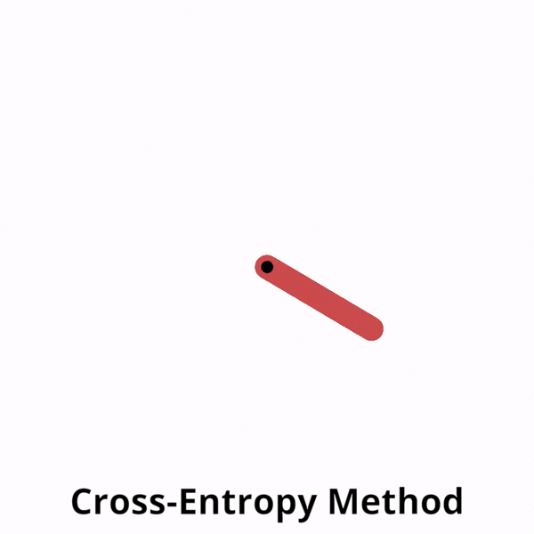
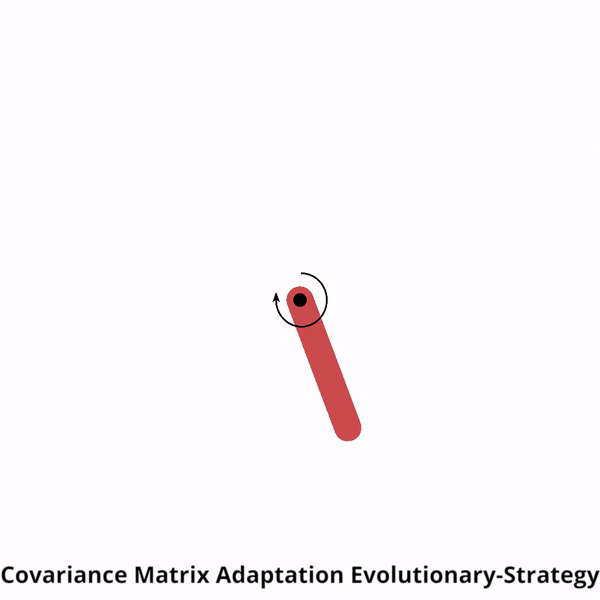
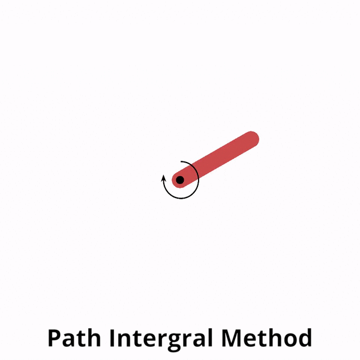
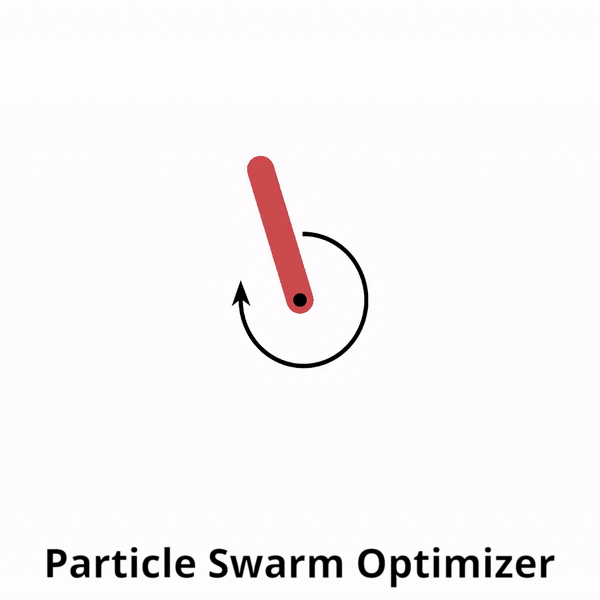
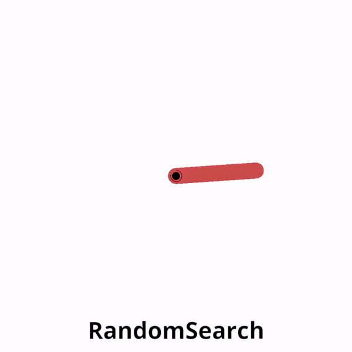
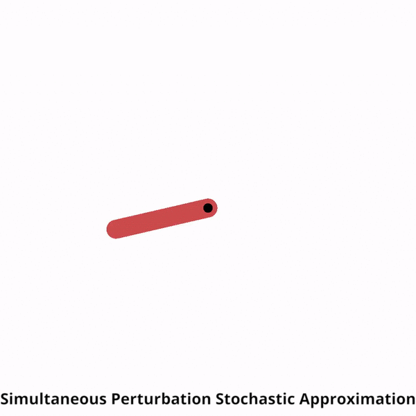

# BlackBox MPC (Model Predictive Control)

[](https://github.com/DAVFoundation/captain-n3m0/blob/master/LICENSE)
[](https://github.com/ossamaAhmed/blackbox_mpc/releases)
[](https://blackbox-mpc.readthedocs.io/en/latest/index.html)
[](https://github.com/ossamaAhmed/blackbox_mpc/graphs/commit-activity)
[](https://github.com/ossamaAhmed/blackbox_mpc/pulls)
[](https://github.com/ossamaAhmed/blackbox_mpc)

## Description

This package provides a framework of different derivative-free optimizers (powered by [Tensorflow 2.0.0](https://www.tensorflow.org/)) which can be used in
conjuction with an MPC (model predictive controller) and an analytical/ learned dynamics model 
to control an agent in a gym environment.

<p align=center>

</p>
<p align=center>

</p>

| **Derivative-Free Optimizer**                | **BlackBox MPC**              |
| --------------------------- | --------------------------------- |
| Cross-Entropy Method (CEM)            | :heavy_check_mark:                |
| Covariance Matrix Adaptation Evolutionary-Strategy (CMA-ES) | :heavy_check_mark:                |
| Path Intergral Method (PI2)         | :heavy_check_mark:                |
| Particle Swarm Optimizer (PSO)        | :heavy_check_mark:                | 
| Random Search (RandomSearch) | :heavy_check_mark:                |
| Simultaneous Perturbation Stochastic Approximation   (SPSA)   | :heavy_check_mark:                |


The package features other functionalities to aid in model-based reinforcement learning (RL) research such as:

- Parallel implementation of the different optimizers using Tensorflow 2.0
- Loading/ saving system dynamics model.
- Monitoring progress using tensorboard.
- Learning dynamics functions.
- Recording videos.
- A modular and flexible interface design to enable research on different trajectory evaluation methods, optimizers, cost functions, system dynamics network architectures or even training algorithms. 
 
<p align=center>

</p>

Optimizers references:
- [CEM](http://web.mit.edu/6.454/www/www_fall_2003/gew/CEtutorial.pdf)
- [CMA-ES](https://arxiv.org/pdf/1604.00772.pdf)
- [PI2](https://ieeexplore.ieee.org/stamp/stamp.jsp?tp=&arnumber=7989202)
- [PSO](https://www.cs.tufts.edu/comp/150GA/homeworks/hw3/_reading6%201995%20particle%20swarming.pdf)
- [SPSA](https://www.jhuapl.edu/SPSA/PDF-SPSA/Spall_Stochastic_Optimization.PDF)

## Iterative MPC

<p align=center>
 
</p>

## Installation

### Install as a pip package from latest release

```bash
pip install blackbox_mpc
```

### Install from source

```bash
git clone https://github.com/ossamaAhmed/blackbox_mpc.git
cd blackbox_mpc
pip install -e .
```

### To use GPU (recommended for faster inference)

```bash
pip install tensorflow_gpu==2.0.0
```


## Usage

The easiest way to get familiar with the framework is to run through the [tutorials](https://github.com/ossamaAhmed/blackbox_mpc/tree/master/tutorials) provided. An example is shown below:
```python
from blackbox_mpc.policies.mpc_policy import \
    MPCPolicy
from blackbox_mpc.utils.pendulum import PendulumTrueModel, \
    pendulum_reward_function
import gym

env = gym.make("Pendulum-v0")
mpc_policy = MPCPolicy(reward_function=pendulum_reward_function,
                       env_action_space=env.action_space,
                       env_observation_space=env.observation_space,
                       true_model=True,
                       dynamics_function=PendulumTrueModel(),
                       optimizer_name='RandomSearch',
                       num_agents=1)

current_obs = env.reset()
for t in range(200):
    action_to_execute, expected_obs, expected_reward = mpc_policy.act(
        current_obs, t)
    current_obs, reward, _, info = env.step(action_to_execute)
    env.render()
```


## Documentation

An API specification and explanation of the code components can be found [here](https://blackbox-mpc.readthedocs.io/en/latest/).

## Visualize Training

<p align=center>

</p>

## Authors

blackbox_mpc is work done by [Ossama Ahmed (ETH Zürich)](https://ossamaahmed.github.io/), [Jonas Rothfuss (ETH Zürich)](https://las.inf.ethz.ch/people/jonas-rothfuss) and [Prof. Andreas Krause (ETH Zurich)](https://las.inf.ethz.ch/krausea).

This package was developed at the [Learning and Adaptive Systems Lab](https://causal-world.readthedocs.io/en/latest/index.html) @ETH Zurich.

## If you use the package, please cite blackbox_mpc

```
@misc{blackbox_mpc,
   author = {Ahmed, Ossama and Rothfuss, Jonas and Krause, Andreas},
   year = {2020},
   publisher = {GitHub},
   journal = {GitHub repository},
   howpublished = {\url{https://github.com/ossamaAhmed/blackbox_mpc}},
}
```

## License

The code is licenced under the MIT license and free to use by anyone without any restrictions.

## TODO

- Add bayesian neural networks (BNN) and graph neural networks (GNN) support.
- Add different trajectory evaluators to propagate uncertainities support.

