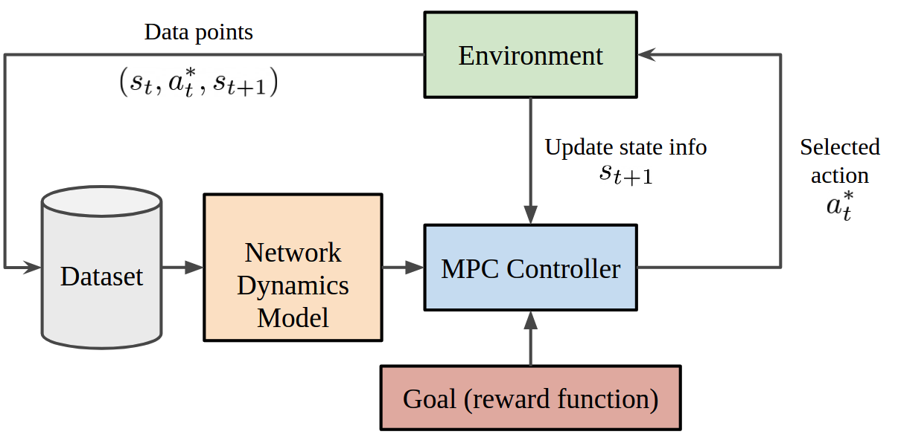
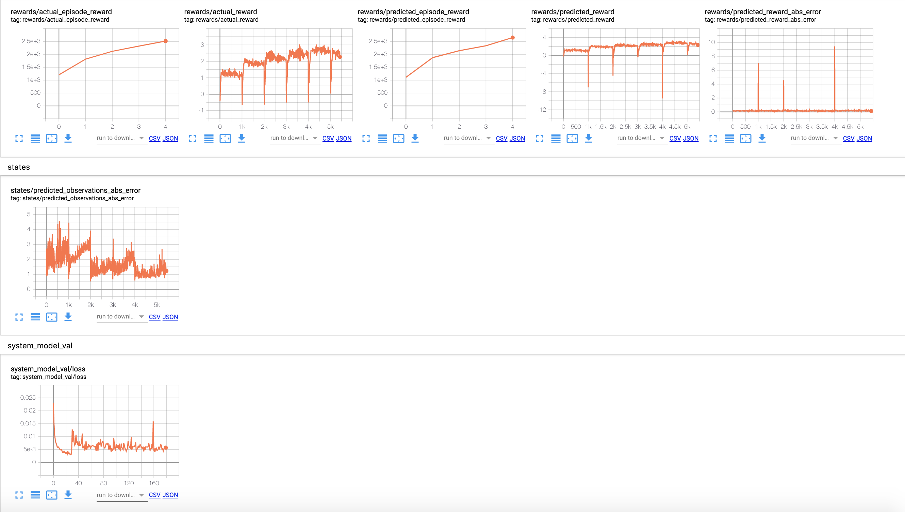

# BlackBox MPC (Model Predictive Control)

## Description

This package provides a framework of different derivative-free optimizers (powered by [Tensorflow 2.0.0](https://www.tensorflow.org/)) which can be used in
conjuction with an MPC (model predictive controller) and an analytical/ learned dynamics model 
to control an agent in a gym environment.

<p align=center>

</p>
<p align=center>

</p>

| **Derivative-Free Optimizer**                | **BlackBox MPC**              |
| --------------------------- | --------------------------------- |
| Cross-Entropy Method (CEM)            | :heavy_check_mark:                |
| Covariance Matrix Adaptation Evolutionary-Strategy (CMA-ES) | :heavy_check_mark:                |
| Path Intergral Method (PI2)         | :heavy_check_mark:                |
| Particle Swarm Optimizer (PSO)        | :heavy_check_mark:                | 
| Random Search (RandomSearch) | :heavy_check_mark:                |
| Simultaneous Perturbation Stochastic Approximation   (SPSA)   | :heavy_check_mark:                |


<p align=center>

</p>

The package features other functionalities to aid in model-based RL research such as:

- Parallel implementation of the different optimizers using Tensorflow 2.0
- Loading/ saving system dynamics model.
- Monitoring progress using tensorboard.
- Learning dynamics functions.
- Recording videos.
- A modular and flexible interface design to enable research on different trajectory evaluation methods, different optimizers, different 
system dynamics network architectures or even different training algorithms. 
 


## Installation

## Usage

The easiest way to get familiar with the framework is to run through the [tutorials](https://github.com/ossamaAhmed/blackbox_mpc/tree/master/tutorials) provided. An example is shown below:
```python
from blackbox_mpc.policies.mpc_policy import \
    MPCPolicy
from blackbox_mpc.utils.pendulum import PendulumTrueModel, \
    pendulum_reward_function
import gym

env = gym.make("Pendulum-v0")
mpc_policy = MPCPolicy(reward_function=pendulum_reward_function,
                       env_action_space=env.action_space,
                       env_observation_space=env.observation_space,
                       true_model=True,
                       dynamics_function=PendulumTrueModel(),
                       optimizer_name='RandomSearch',
                       num_agents=1)

current_obs = env.reset()
for t in range(200):
    action_to_execute, expected_obs, expected_reward = mpc_policy.act(
        current_obs, t)
    current_obs, reward, _, info = env.step(action_to_execute)
    env.render()
```


## Documentation

An API specification and explanation of the code components can be found [here](http://ossamaahmed.github.io/TF-NeuralMPC/).

## Results
<p align=center>

</p>


<p align=center>

</p>

## Authors

blackbox_mpc is work done by [Ossama Ahmed (ETH Zürich)](https://ossamaahmed.github.io/), [Jonas Rothfuss (ETH Zürich)](https://las.inf.ethz.ch/people/jonas-rothfuss) and [Prof. Andreas Krause (ETH Zurich)](https://las.inf.ethz.ch/krausea).

This package was developed at the [Learning and Adaptive Systems Lab](https://causal-world.readthedocs.io/en/latest/index.html) @ETH Zurich.

## License

The code is licenced under the MIT license and free to use by anyone without any restrictions.