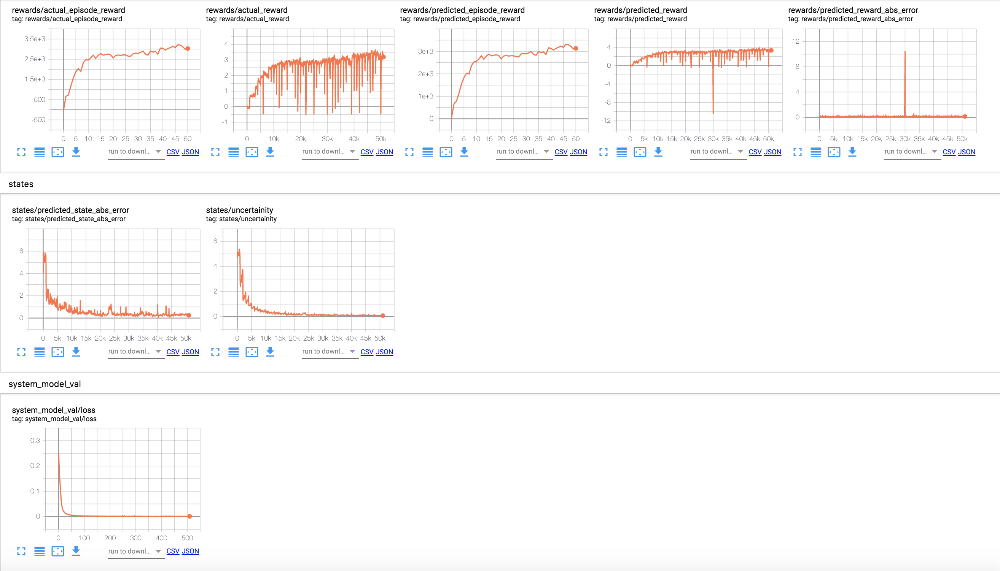

# TF-NeuralMPC - Model Predictive Control with TensorFlow

Despite the impressive results of current RL algorithms, they still face important limitations, namely, low
sample efficiency and a propensity not to generalize to seemingly minor changes in the task. These challenges
suggest that large capacity model-free RL models tend to overfit to the abundant data on which they are trained
on and hence fail to learn an abstract, interpretable, and generalizable understanding of the underlying problem.
Model-based RL on the other hand learns a forward model of the environment and then uses it in conjunction
with a model-predictive controller for instance to control the agent/ robot, the advantage here is that the learned
forward model can be used in performing different tasks.

<p align=center>

</p>

The code repository provides a framework of different derivative-free optimizers which can be used in
conjuction with a model predictive controller and a learned dynamics model to control an agent in a
mujoco or a gym environment.

The code was written as part of a research project at the Learning and Adaptive Systems Lab @ETH Zurich.
Overall, the aim of this package is to enable performing optimal control with  model-predictive control
on any mujoco or gym environment in couple of steps.

Overall this repository consists of two branches:

1) master: lightweight branch that provides the necessary code to run an MPC controller with a learned or analytical 
           dynamics model. This branch is meant to provide an easy start with TF-NeuralMPC.
2) full-version: branch that provides extra functionalities that are still under development like using a bayesian neural
                 network to capture the epistemic and possibly the aleotoric uncertainities. It also includes different 
                 methods for trajectory evaluation/ particles propagation when predicting the next state with a stochastic
                 dynamics model. 

The code is written in Python 3 and builds on [Tensorflow 2.0.0](https://www.tensorflow.org/). 
Many of the provided reinforcement learning environments require the [Mujoco](http://www.mujoco.org/) physics engine.
Overall the code was developed under consideration of modularity and computational efficiency.
Many components of the TF-NeuralMPC components are parallelized either using 
[Tensorflow](https://www.tensorflow.org/) in order to ensure efficient use of all CPU cores.

## Installation

### Virtualenv (Recommended)
```
pip install --upgrade virtualenv
virtualenv <venv-name>
source <venv-name>/bin/activate
```

### Set up the Mujoco physics engine and mujoco-py (if not done yet)
For running the majority of the gym environments, the Mujoco physics engine as well as a 
corresponding python wrapper are required.
For setting up [Mujoco](http://www.mujoco.org/) and [mujoco-py](https://github.com/openai/mujoco-py), 
please follow the instructions [here](https://github.com/openai/mujoco-py).

### Installing TF-NeuralMPC
Install the requirments first by ``pip install -r requirements.txt``
The easiest way to install the necessary python libraries is by installing pip (e.g. ``apt-get install python-pip`` on Ubuntu) and cloning the 
repository, then installing it using ``pip install -e .``

Note: If you have a gpu, uncomment the gpu version of tensorflow in the requirements.txt.

Note: Make sure to upgrade pip before installing thr requirements ``python -m pip install --upgrade pip``

## Usage

The easiest way to get familiar with the framework is to run through the tutorials provided. An example is shown below:
```python
from blackbox_mpc.environment_utils import EnvironmentWrapper
from blackbox_mpc.examples.true_models import PendulumTrueModel
from blackbox_mpc.examples.cost_funcs import pendulum_state_reward_function, pendulum_actions_reward_function
import numpy as np
from blackbox_mpc import Runner

number_of_agents = 5
single_env, parallel_env = EnvironmentWrapper.make_standard_gym_env("Pendulum-v0", random_seed=0,
                                                                    num_of_agents=number_of_agents)
my_runner = Runner(env=[single_env, parallel_env],
                   log_path=None,
                   num_of_agents=number_of_agents)
mpc_controller = my_runner.make_mpc_policy(dynamics_function=PendulumTrueModel(),
                                           state_reward_function=pendulum_state_reward_function,
                                           actions_reward_function=pendulum_actions_reward_function,
                                           planning_horizon=30,
                                           optimizer_name='PI2',
                                           true_model=True)

current_obs = single_env.reset()
current_obs = np.tile(np.expand_dims(current_obs, 0),
                      (number_of_agents, 1))
for t in range(200):
    action_to_execute, expected_obs, expected_reward = mpc_controller.act(current_obs, t)
    current_obs, reward, _, info = single_env.step(action_to_execute[0])
    current_obs = np.tile(np.expand_dims(current_obs, 0),
                          (number_of_agents, 1))
    single_env.render()

```


## Documentation

An API specification and explanation of the code components can be found [here](http://ossamaahmed.github.io/TF-NeuralMPC/).

## Results
<p align=center>

</p>


<p align=center>

</p>

## License

The code is licenced under the MIT license and free to use by anyone without any restrictions.