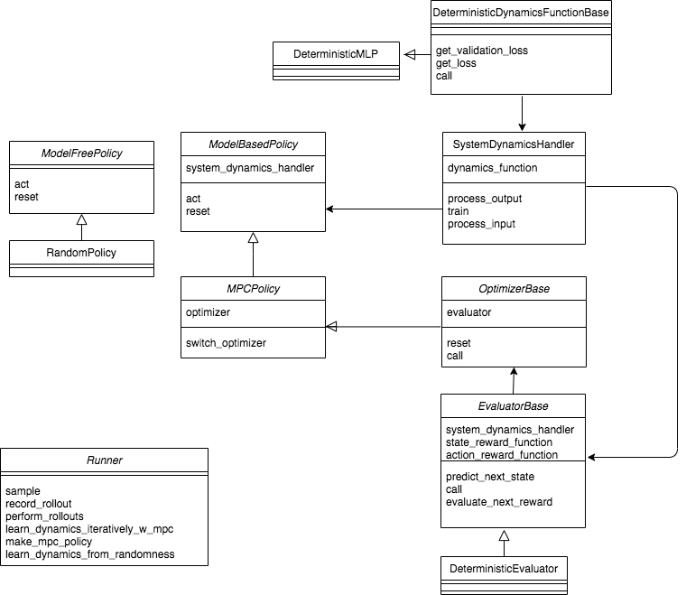
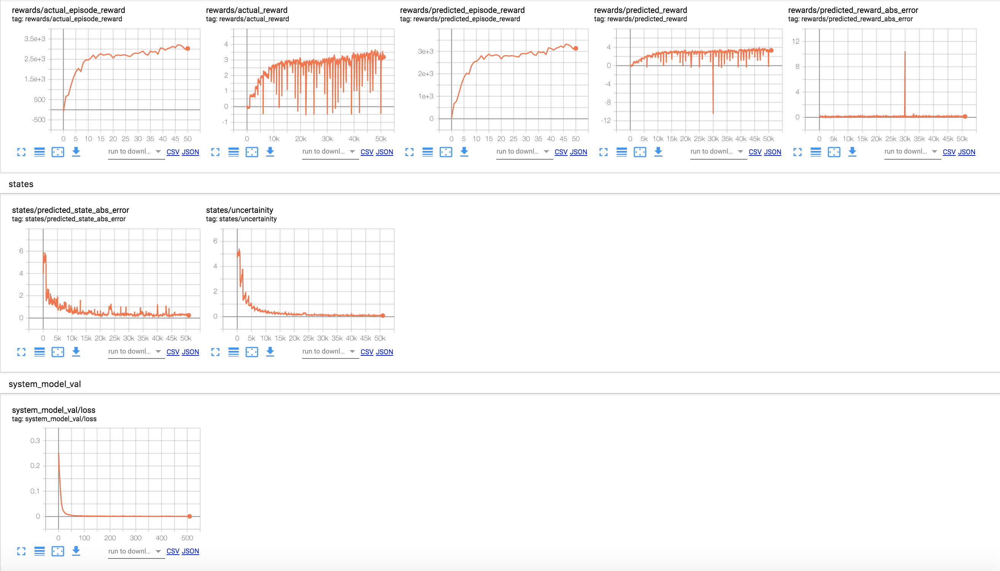

About BlackBox_MPC
==================

Despite the impressive results of current RL algorithms, they still face important limitations, namely, low
_sample efficiency and a propensity not to generalize to seemingly minor changes in the task. These challenges
suggest that large capacity model-free RL models tend to overfit to the abundant data on which they are trained
on and hence fail to learn an abstract, interpretable, and generalizable understanding of the underlying problem.
Model-based RL on the other hand learns a forward model of the environment and then uses it in conjunction
with a model-predictive controller for instance to control the agent/ robot, the advantage here is that the learned
forward model can be used in performing different tasks.

.. image:: mpc.png
   :width: 600

The code repository provides a framework of different derivative-free optimizers which can be used in
conjuction with a model predictive controller and a learned dynamics model to control an agent in a
mujoco or a gym environment.

The code was written as part of a research project at the Learning and Adaptive Systems Lab @ETH Zurich.
Overall, the aim of this package is to be enable performing optimal control with  model-predictive control
on any mujoco or gym environment in couple of steps. An example can be seen below:

.. code-block:: python

   number_of_agents = 5
   single_env, parallel_env = EnvironmentWrapper.make_standard_gym_env("Pendulum-v0", random_seed=0,
                                                                    num_of_agents=number_of_agents)
   my_runner = Runner(env=[single_env, parallel_env],
                   log_path=None,
                   num_of_agents=number_of_agents)
   mpc_controller = my_runner.make_mpc_policy(dynamics_function=PendulumTrueModel(),
                                           state_reward_function=pendulum_state_reward_function,
                                           actions_reward_function=pendulum_actions_reward_function,
                                           planning_horizon=30,
                                           optimizer_name='PI2',
                                           true_model=True)

   current_obs = single_env.reset()
   current_obs = np.tile(np.expand_dims(current_obs, 0),
                      (number_of_agents, 1))
   for t in range(200):
    action_to_execute, expected_obs, expected_reward = mpc_controller.act(current_obs, t)
    current_obs, reward, _, info = single_env.step(action_to_execute[0])
    current_obs = np.tile(np.expand_dims(current_obs, 0),
                          (number_of_agents, 1))
    single_env.render()

This high level functionalities of the package are implemented in the Runner class and the overall structure and interaction
of the code components is depicted in the following figure:

There is the option of logging the results in tensorboard and saving the dynamics model trained as the following:

.. image:: results.png
   :width: 1000

.. toctree::
   :maxdepth: 3
   :caption: Contents:

   modules/blackbox_mpc.rst

Indices and tables
==================

* :ref:`genindex`
* :ref:`modindex`