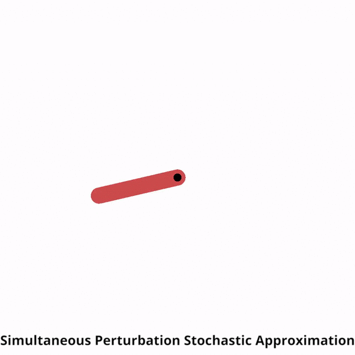
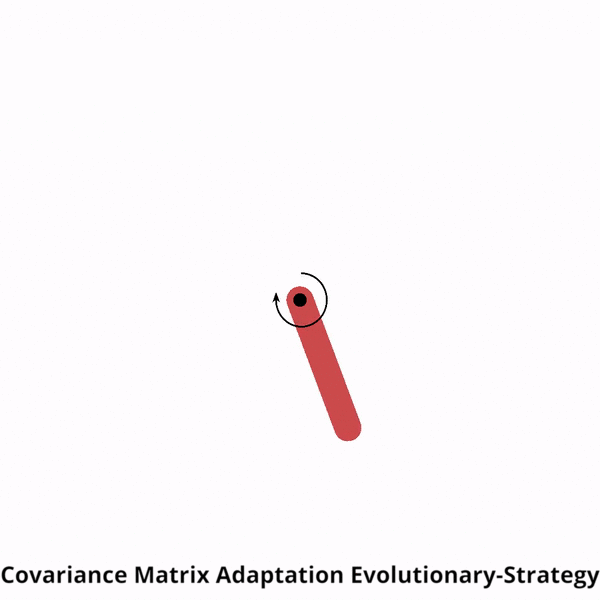

About BlackBox_MPC
==================

This `package <https://github.com/ossamaAhmed/blackbox_mpc>`_ provides a framework of different derivative-free optimizers (powered by `Tensorflow 2.0.0 <https://www.tensorflow.org/>`_) which can be used in
conjuction with an MPC (model predictive controller) and an analytical/ learned dynamics model
to control an agent in a gym environment.

.. image:: ./media/cem.gif
   :scale: 30 %
   :alt: CEM
   :align: left

.. image:: ./media/pi2.gif
   :scale: 30 %
   :alt: PI2
   :align: left

.. image:: ./media/pso.gif
   :scale: 30 %
   :alt: PSO
   :align: left

.. image:: ./media/rs.gif
   :scale: 30 %
   :alt: RS
   :align: left

.. |br| raw:: html

    

|br| |br| |br| |br| |br| |br| |br| |br| |br| |br| |br| |br| |br| |br| |br| |br| |br|

Derivative-free optimizers available so far:

- Cross-Entropy Method (CEM) - `cem reference <http://web.mit.edu/6.454/www/www_fall_2003/gew/CEtutorial.pdf>`_
- Covariance Matrix Adaptation Evolutionary-Strategy (CMA-ES) `cma-es reference <https://arxiv.org/pdf/1604.00772.pdf>`_
- Path Intergral Method (PI2) `pi2 reference <https://ieeexplore.ieee.org/stamp/stamp.jsp?tp=&arnumber=7989202>`_
- Particle Swarm Optimizer (PSO) `pso reference <https://www.cs.tufts.edu/comp/150GA/homeworks/hw3/_reading6%201995%20particle%20swarming.pdf>`_
- Random Search (RandomSearch)
- Simultaneous Perturbation Stochastic Approximation (SPSA) `spsa reference <https://www.jhuapl.edu/SPSA/PDF-SPSA/Spall_Stochastic_Optimization.PDF>`_

.. image:: ./media/mpc.png
   :width: 600

The package features other functionalities to aid in model-based reinforcement learning (RL) research such as:

- Parallel implementation of the different optimizers using Tensorflow 2.0
- Loading/ saving system dynamics model.
- Monitoring progress using tensorboard.
- Learning dynamics functions.
- Recording videos.
- A modular and flexible interface design to enable research on different trajectory evaluation methods, optimizers, cost functions, system dynamics network architectures or even training algorithms.

The easiest way to get familiar with the framework is to run through the `tutorials <https://github.com/ossamaAhmed/blackbox_mpc/tree/master/tutorials>`_ provided. An example is shown below:

.. code-block:: python

   from blackbox_mpc.policies.mpc_policy import \
    MPCPolicy
   from blackbox_mpc.utils.pendulum import PendulumTrueModel, \
       pendulum_reward_function
   import gym

   env = gym.make("Pendulum-v0")
   mpc_policy = MPCPolicy(reward_function=pendulum_reward_function,
                          env_action_space=env.action_space,
                          env_observation_space=env.observation_space,
                          true_model=True,
                          dynamics_function=PendulumTrueModel(),
                          optimizer_name='RandomSearch',
                          num_agents=1)

   current_obs = env.reset()
   for t in range(200):
       action_to_execute, expected_obs, expected_reward = mpc_policy.act(
           current_obs, t)
       current_obs, reward, _, info = env.step(action_to_execute)
       env.render()

There is an option of logging some of the training stats in tensorboard as shown below.

.. image:: ./media/results.png
   :width: 1000

.. toctree::
   :maxdepth: 2
   :caption: Guide

   guide/install.rst
   guide/getting_started.rst

.. toctree::
   :maxdepth: 3
   :caption: API

   modules/blackbox_mpc.rst

Indices and tables
==================

* :ref:`genindex`
* :ref:`modindex`